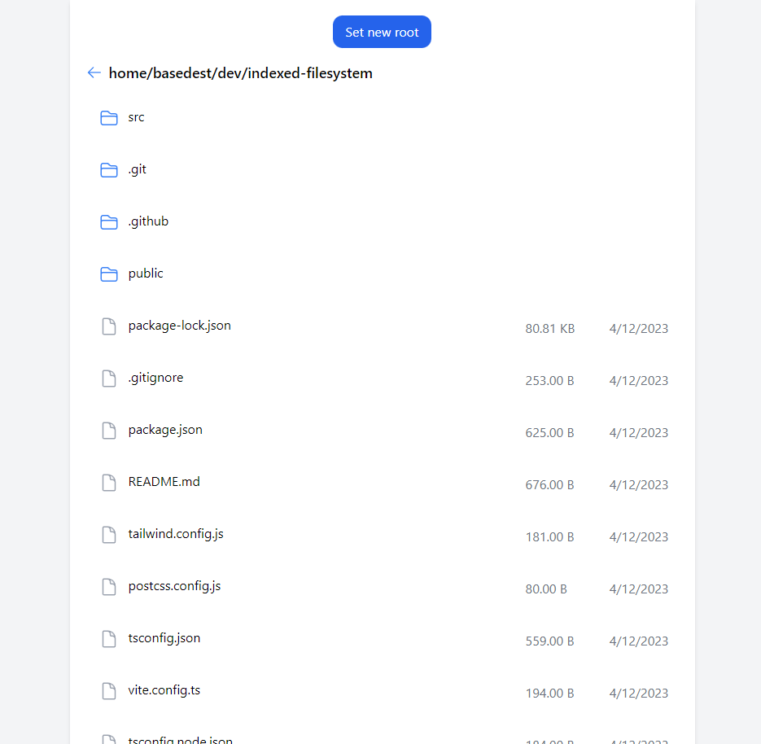

# indexed-filesystem

*Fun little project to experiment with File System Access API and IndexedDB.*

## Description

Ok so basically you first need to grant permission to your local directory (that'll be "root" directory for app)
and then its contents become available for you to see in browser.
You can also change root directory any time if you wish.

## Explanation

The IndexedDB part is needed to persistently store `FileSystemDirectoryHandle` so
site could load it when the page's reloaded. However, you still need to grant permission every time you
refresh the page. It's not my fault, it's the way things work in Chromium rn (in Firefox they simply don't work at all)
